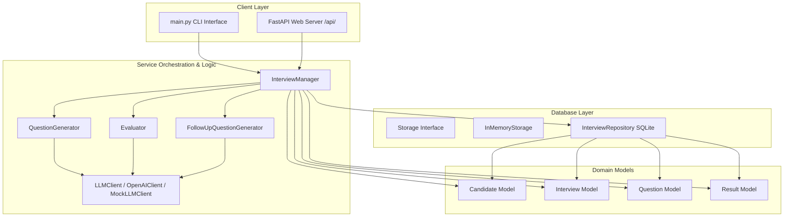

# AI Interview Bot

An intelligent, Object-Oriented system designed to conduct automated technical interviews across multiple domains (Java, Python, DSA, OOP, SQL) using Large Language Models (LLMs).

## Project Purpose
The AI Interview Bot aims to streamline and standardise the initial screening phases of technical recruitment. By using generative AI, the bot simulates a real technical interviewer: asking target domain-specific questions, collecting response answers, dynamically evaluating candidates, and saving candidate history. This provides recruiters with consistent, data-driven feedback on a candidate's readiness before standard human interviews.

## Features
- **Technical Domain Selection**: Support for Java, Python, Data Structures & Algorithms (DSA), Object-Oriented Programming (OOP), and SQL.
- **Dynamic Question Generation**: Leverages LLMs to generate contextual technical questions of varying difficulty levels.
- **Candidate Evaluation**: Automatically grades answers using an LLM evaluator against rubrics and assigns a scoring system.
- **Interview Session Tracking**: Models stateful interviews allowing step-by-step progress.
- **Interview History & Reports**: Structures results to save detailed, persistent logs of candidate performance.

---

## Architecture

The project follows standard **Object-Oriented Programming (OOP)** and clean-architecture separation of concerns:



- `src/models/`: Encapsulates pure domain models and core states ([`Candidate`](file:///c:/Users/hp/.gemini/antigravity-ide/scratch/ai-interview-bot/src/models/candidate.py), [`Question`](file:///c:/Users/hp/.gemini/antigravity-ide/scratch/ai-interview-bot/src/models/question.py), [`Interview`](file:///c:/Users/hp/.gemini/antigravity-ide/scratch/ai-interview-bot/src/models/interview.py), [`Result`](file:///c:/Users/hp/.gemini/antigravity-ide/scratch/ai-interview-bot/src/models/result.py)).
- `src/services/`: Core logic layer ([`QuestionGenerator`](file:///c:/Users/hp/.gemini/antigravity-ide/scratch/ai-interview-bot/src/services/question_generator.py), [`Evaluator`](file:///c:/Users/hp/.gemini/antigravity-ide/scratch/ai-interview-bot/src/services/evaluator.py), [`FollowUpQuestionGenerator`](file:///c:/Users/hp/.gemini/antigravity-ide/scratch/ai-interview-bot/src/services/follow_up_question_generator.py), [`LLMClient`](file:///c:/Users/hp/.gemini/antigravity-ide/scratch/ai-interview-bot/src/services/llm_client.py)).
- `src/database/`: Persistence layer interfaces and SQLite repository ([`Storage`](file:///c:/Users/hp/.gemini/antigravity-ide/scratch/ai-interview-bot/src/database/storage.py), [`InterviewRepository`](file:///c:/Users/hp/.gemini/antigravity-ide/scratch/ai-interview-bot/src/database/sqlite_repository.py)).
- `src/api/`: FastAPI web server application ([`main.py`](file:///c:/Users/hp/.gemini/antigravity-ide/scratch/ai-interview-bot/src/api/main.py), [`schemas.py`](file:///c:/Users/hp/.gemini/antigravity-ide/scratch/ai-interview-bot/src/api/schemas.py)).
- `src/utils/`: Generic helper functions ([`helpers.py`](file:///c:/Users/hp/.gemini/antigravity-ide/scratch/ai-interview-bot/src/utils/helpers.py)).

---

## Installation Steps

### Prerequisites
- Python 3.10+
- SQLite3
- Docker & Docker Compose (Optional, for containerized run)

### Local Setup
1. **Clone the Repository**:
   ```bash
   git clone <repository-url>
   cd ai-interview-bot
   ```

2. **Set up a Virtual Environment**:
   ```bash
   python -m venv venv
   source venv/bin/activate  # On Windows: venv\Scripts\activate
   ```

3. **Install Dependencies**:
   ```bash
   pip install -r requirements.txt
   ```

4. **Configure Environment Variables**:
   Copy `.env.example` to `.env` and fill in your OpenAI API Key (or leave blank to automatically use the Mock client):
   ```bash
   cp .env.example .env
   ```

---

## Example Usage

### 1. Interactive CLI Mode
To run the automated interview directly inside your terminal, execute:
```bash
python main.py
```
This CLI guides you through candidate registration, domain/difficulty selection, interactive Q&A (including dynamic follow-up prompts), and prints a performance card at the end.

### 2. FastAPI Web Mode
To launch the REST API server locally:
```bash
uvicorn src.api.main:app --reload --port 8000
```
Visit http://127.0.0.1:8000/docs to explore the interactive Swagger documentation.

#### API Flow Example using `curl`:
- **Create Candidate**:
  ```bash
  curl -X POST http://127.0.0.1:8000/candidate \
    -H "Content-Type: application/json" \
    -d '{"name": "Alice", "email": "alice@example.com", "skills": ["Python"]}'
  ```

- **Start Session**:
  ```bash
  curl -X POST http://127.0.0.1:8000/interview/start \
    -H "Content-Type: application/json" \
    -d '{"topic": "Python", "difficulty": "Easy", "count": 2, "name": "Alice", "email": "alice@example.com"}'
  ```

- **Get Next Question**:
  ```bash
  curl -X POST http://127.0.0.1:8000/interview/next \
    -H "Content-Type: application/json" \
    -d '{"interview_id": "INT-<id-from-start-response>"}'
  ```

- **Submit Response**:
  ```bash
  curl -X POST http://127.0.0.1:8000/interview/answer \
    -H "Content-Type: application/json" \
    -d '{"interview_id": "INT-<id>", "question_id": "Q-PYTHON-01", "answer": "Lists are mutable, tuples are immutable."}'
  ```

---

## Docker Support

### Running with Docker Compose
Start the FastAPI server containerized along with persistent SQLite database storage:
```bash
docker-compose up --build
```
This automatically binds FastAPI to port `8000` on your host machine.

---

## Future Improvements
- **Interactive Web Interface**: A modern React or Vue frontend for candidates to take interviews.
- **Audio/Voice Response Analysis**: Allowing candidates to speak their answers, using Speech-to-Text and analyzing voice tone/confidence.
- **Code Execution Sandbox**: Executing candidate code (especially for Python/DSA/SQL) to verify correctness automatically alongside LLM conceptual feedback.
- **Advanced Dynamic Prompts**: Adapting difficulty on-the-fly based on candidate response quality (adaptive interview pathing).
- **Recruiter Dashboard**: An interface to search, filter, and review completed interview reports.
